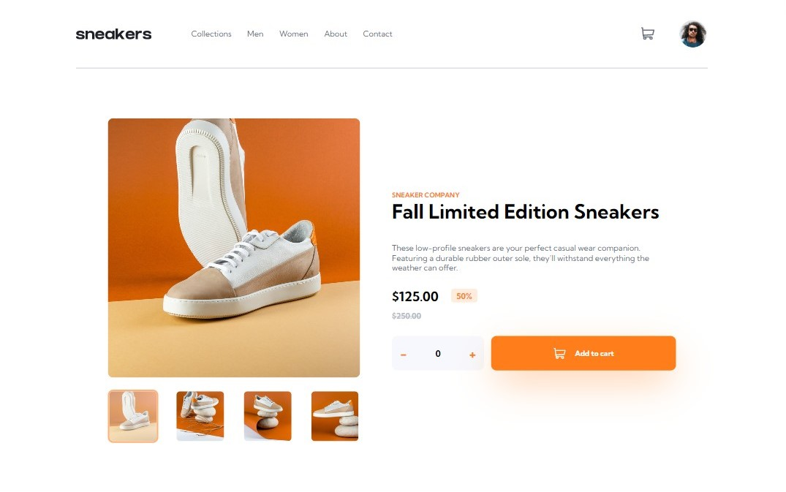

# Frontend Mentor - E-commerce product page solution

This is a solution to the [E-commerce product page challenge on Frontend Mentor](https://www.frontendmentor.io/challenges/ecommerce-product-page-UPsZ9MJp6). Frontend Mentor challenges help you improve your coding skills by building realistic projects.

## Table of contents

- [Frontend Mentor - E-commerce product page solution](#frontend-mentor---e-commerce-product-page-solution)
  - [Table of contents](#table-of-contents)
  - [Overview](#overview)
    - [The challenge](#the-challenge)
    - [Screenshot](#screenshot)
    - [Links](#links)
  - [My process](#my-process)
    - [Built with](#built-with)
    - [What I learned](#what-i-learned)
    - [Continued development](#continued-development)
    - [Useful resources](#useful-resources)
  - [Author](#author)

## Overview

### The challenge

Users should be able to:

- View the optimal layout for the site depending on their device's screen size
- See hover states for all interactive elements on the page
- Open a lightbox gallery by clicking on the large product image
- Switch the large product image by clicking on the small thumbnail images
- Add items to the cart
- View the cart and remove items from it

### Screenshot



### Links

- Solution URL: [Sneakers Github Repository](https://github.com/Adrian-py/Sneakers)
- Live Site URL: [Sneakers Site](https://adrian-py.github.io/Sneakers/)

## My process

### Built with

- Semantic HTML5 markup
- CSS custom properties
- Flexbox
- SASS
- Desktop-first workflow

### What I learned

Throughout doing the project, there are several things that I have learned regarding CSS and HTML.

1. **Creating popups**
   Prior to doing this project, I have known some techniques in showing popups when hovered. Regardless, this is my first time trying it in this project.

2. **Resizing images**
   I came across an issue regarding images being pressed when the size of the container is not the same as the actual image size. Through researching on google, I discored a way to prevent this using:

```css
object-fit: cover;
```

and

```css
background-size: cover;
```

Those lines of code prevents images from being compressed when the image container size is not the same as the original image size.

### Continued development

For future projects, some technologies that I like to use are, React, Next.js, styled components, tailwind, and svelte. The technologies that is mentioned before are some of the current most popular technologies not only in the global technology industry, but also in my country of origin Indonesia.

### Useful resources

- [Stackoverflow](https://stackoverflow.com/) - This helped me for solving both CSS and Javascript issues I encountered.
- [w3schools](https://www.w3schools.com/) - I used this website often to check certain syntax of HTML, CSS and Javascript code.

## Author

- Github - [Adrian-py](https://github.com/Adrian-py)
- Frontend Mentor - [@Adrian-py](https://www.frontendmentor.io/profile/Adrian-py)
